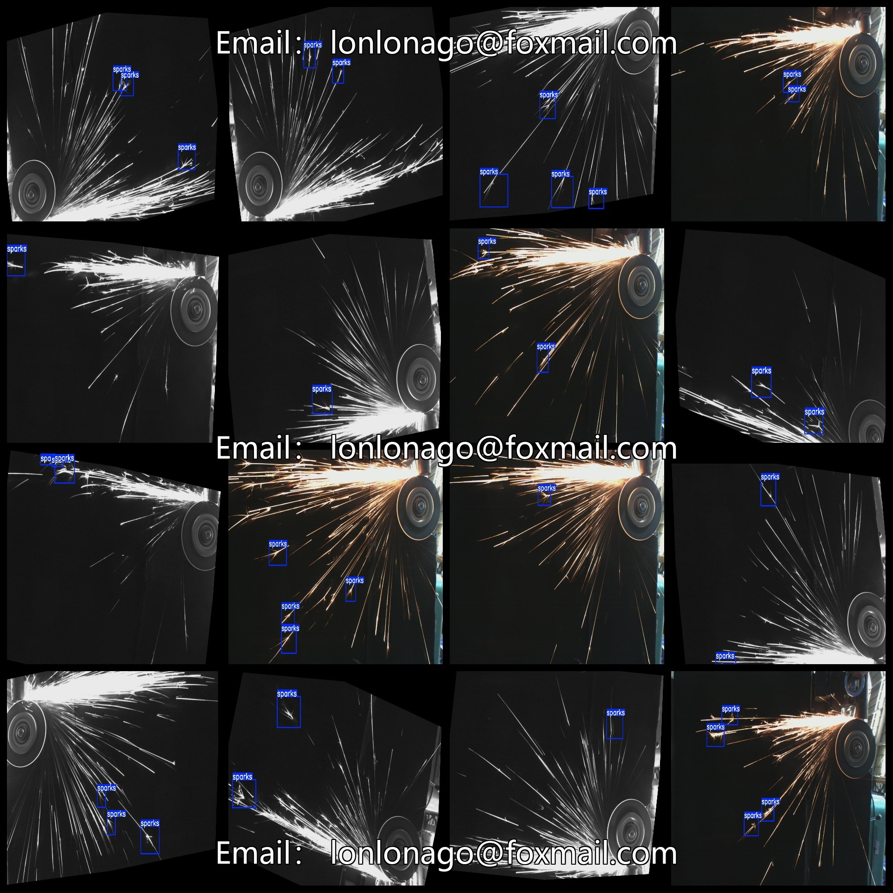

# Fire Star Spark Detection Dataset 3777 images VOC+YOLO format

Mars Spark Detection Dataset: 3777 images in VOC+YOLO format

Dataset format: Pascal VOC format + YOLO format (excluding the split path in txt files, only containing jpg images along with corresponding VOC and YOLO format xml files and txt files)

Number of images (jpg file count): 3777

Number of annotations (xml file count): 3777

Number of annotations (txt file count): 3777

Number of annotation categories: 1

Repository location: datasets_sl

Annotation category names: ["sparks"]

Number of bounding boxes per category:

Sparks = 7288

Total bounding box count: 7288

Number of images per category:

Sparks = 3777

Image resolution: Multi-resolution images, such as 2006x1336, 2048x1365, etc.

Labeling tool used: labelImg

Dataset enhancement status: Yes

Annotation rules: Draw rectangular boxes for each class

Important Notice: The dataset does not have been split into training, validation, or test sets; users need to do so themselves.

Special Disclaimer: This dataset does not guarantee any accuracy for trained models or weight files.

Annotation and image details are as follows:

## Images

---

Here is a pay link on Stripe (https://buy.stripe.com/3cs8yP7sY87d0vu9AB). Please contact me lonlonago@foxmail.com after funding $89, and I will send you a complete data files, thank you!

